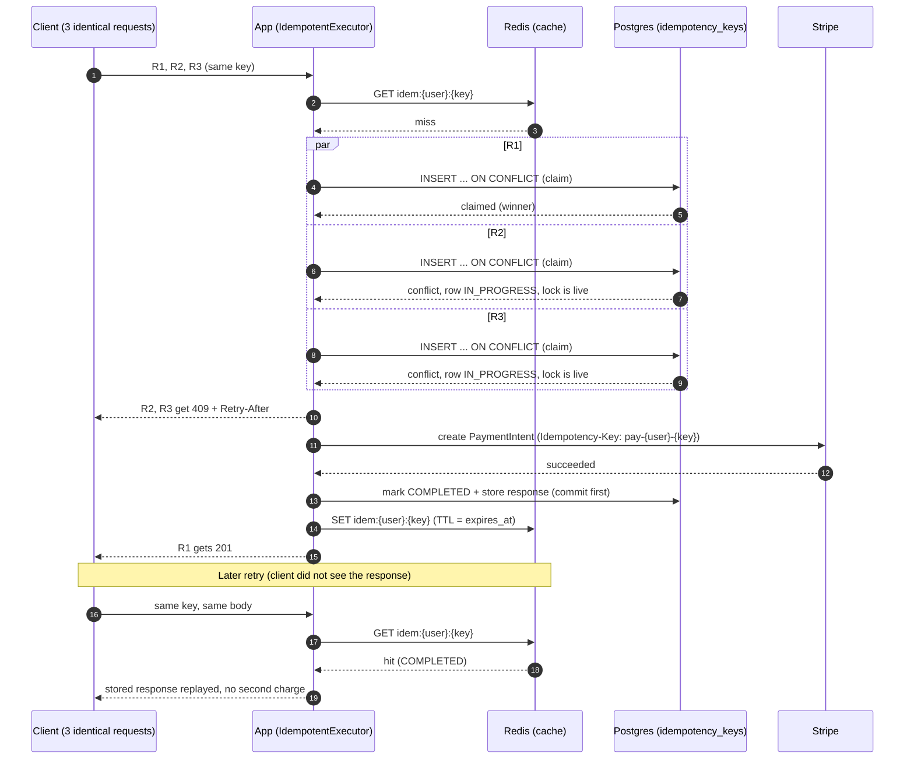
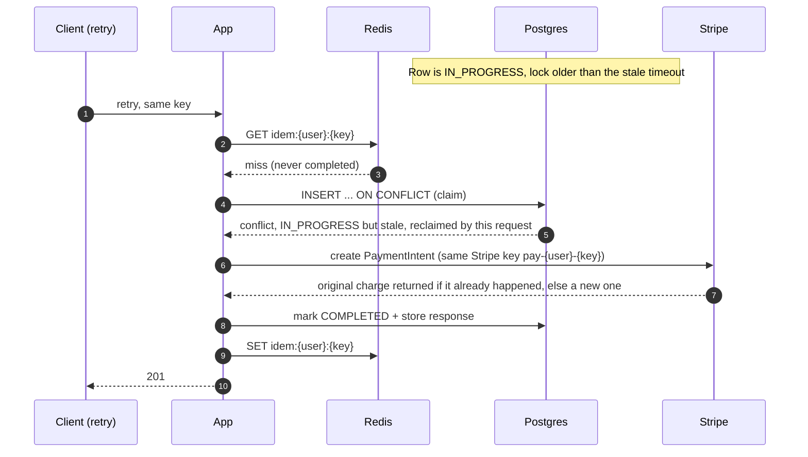

# Sequence diagrams: idempotency race and reclaim path

Diagrams use Mermaid (renders on GitHub and in most Markdown viewers).

## 1. The race: 3 identical requests at the same instant

R1, R2, R3 carry the same `Idempotency-Key`. Postgres picks exactly one winner with one atomic statement.

Key points:
- Only one request runs the real work. The unique constraint decides the winner, not application code.
- Losers get `409` with `Retry-After` instead of waiting, so they do not hold a thread or a DB connection.
- Postgres commits before Redis is written. If the Redis write fails, the next request just falls back to Postgres.

## 2. Reclaim path: the winner crashed

The first request claimed the key and then the server died. The row is stuck IN_PROGRESS with an old lock.

Key points:
- Without reclaim, a crash would block that key until it expires.
- The same Stripe key is reused, so if the charge already happened before the crash, Stripe returns it instead of charging again.
- Expired rows are recycled in the same claim statement.

## 3. Mismatch and missing key

| Situation | Result |
|---|---|
| No `Idempotency-Key` header | `400` |
| Same key, different request hash | `422` |
| Same key, first request still running (live lock) | `409` + `Retry-After` |
| Same key, first request finished | stored response replayed |
| Same key, first request crashed (stale lock) | reclaimed and re-run |